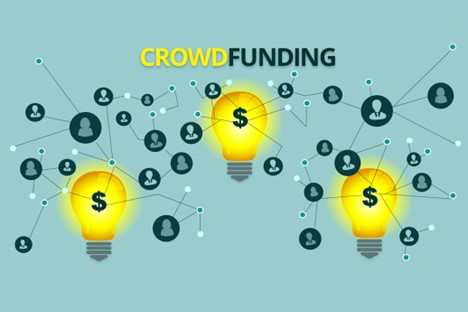

# Crowdfunding ETL Project

## Overview 
The purpose of the project is to apply ETL methodology to data analysis by performing the following:

<ol> •	Extract..... </ol>
<ol> •	Transform.... </ol>
<ol> •	Load.... </ol>

## Group 10 Members:
<li> Ry Avery </li>
<li> Jennifer Duckworth </li>
<li> Nicole Bustamante </li>
<li> Kiana Navarre </li>
<li> Angelica Victoria </li> 
 

## Results
(need to decide if list or links)

<li>  Category and Subcategory DataFrames </li>
<li>  Campaign DataFrame </li>
<li>  Contacts DataFrame </li>
<li>  Category CSV </li>
<li>  Subategory CSV </li>
<li>  Campaign CSV </li>
<li>  Contacts CSV </li>
<li>  Crowdfunding Database </li>
<li>  Crowdfunding DB Schema </li>
 
<li><a href = ""> Category CSV </a></li>
<li><a href = ""> Subategory CSV </a></li>
<li><a href = ""> Campaign CSV </a></li>
<li><a href = ""> Contacts CSV </a></li>
<li><a href = ""> Crowdfunding Database </a></li>
<li><a href = ""> Crowdfunding DB Schema </a></li>
 

## Resources
#### <b>Data Source:</b> 
contacts.xlsx, crowdfunding.xlsx
#### <b>Software:</b> 
Jupyter Notebook, Python, Pandas, Postgres/pgAdmin, VSCode